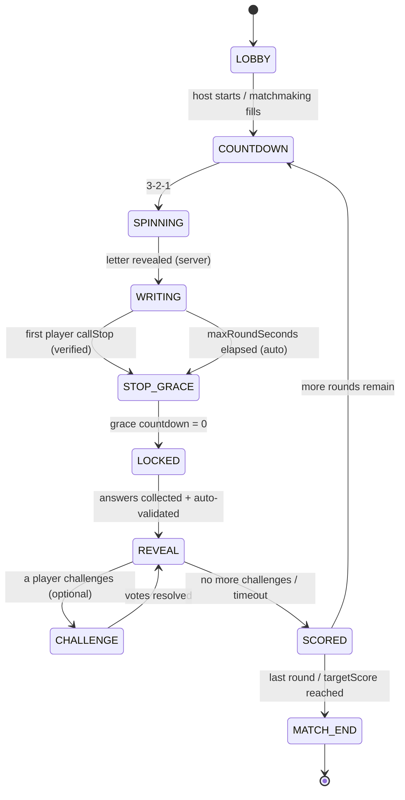

# CLAUDE_CODE_STOP_GAME_BUILD_v1.md
### Master build prompt — "STOP" real-time multiplayer word game (Categories / Le Petit Bac / لعبة الاسم)

> **How to use this file.** Hand this whole document to Claude Code (or a dev team) as the authoritative product + engineering spec. Build in the phases in §17. Everything marked **[CONFIG]** must be a runtime-editable value in a single `ruleset` object, never hard-coded. Everything marked **[DoD]** is a Definition-of-Done acceptance check. When a decision is ambiguous, default to the value stated here and expose it as config.

---

## 0. TL;DR for the builder

Build a cross-platform (iOS + Android + Web), real-time multiplayer party game of **STOP**. A random letter is chosen by a **server-authoritative spinning wheel**; all players race to fill one word per category starting with that letter; the first to complete all categories hits **STOP**, which freezes the round for everyone after a short grace countdown; answers are revealed, auto-validated (multi-language), optionally peer-challenged, and scored (unique = high, duplicate = low, invalid/empty = zero). Support **private rooms with friends** (invite code / deep link) and **quick match with strangers** (MMR-based matchmaking), plus a **ranked ladder, global/friends/seasonal leaderboards, profiles, and stats**. Languages: **English, French, Arabic (full RTL + Arabic letter wheel)**.

**Non-negotiables:** server authority over the letter and over round timing (anti-cheat); a polished, physical-feeling wheel as the hero moment; fast frictionless answer entry; a dramatic results reveal; graceful disconnect/reconnect; and clean RTL/Arabic support (not an afterthought).

---

## 1. Product brief

- **Elevator pitch:** The classic schoolyard word race, online with your friends or the world — spin the wheel, beat the clock, and prove you're the fastest, sharpest mind at the table.
- **Core loop (≤ 60s per round):** Spin wheel → letter revealed → race to fill categories → first-done hits STOP → reveal → score → next round. A match = several rounds. Highest total wins. Rematch in one tap.
- **Session length:** 3–7 minutes for a 5-round match. Optimized for "one more game."
- **Audience:** 13+, casual-competitive, mobile-first, social. Multilingual GCC/MENA + FR + global EN. Plays 2–8 people.
- **Working title options (pick later):** *STOP!*, *Spin & Stop*, *Letter Rush*, *Categoria*. Arabic-friendly wordmark; the exclamation/stop-hand is the brand asset.
- **Platforms:** One TypeScript codebase via **Expo (React Native)** targeting iOS, Android, and Web (Expo Web / React Native Web). Web build is a first-class citizen for desktop play and for shareable game links.
- **Design pillars:** (1) *Speed & pressure* — every screen respects that seconds matter. (2) *Fairness you can feel* — the wheel and scoring are visibly, provably fair. (3) *Delight in the reveal* — the moment answers flip over is the emotional peak. (4) *Effortless play-with-friends* — from "let's play" to "in a game" in < 15 seconds.

---

## 2. The game — canonical ruleset (authoritative)

This is the version to build. All numeric values are **[CONFIG]** on the `ruleset`.

### 2.1 Setup
- A match has **2–8 players** **[CONFIG: `minPlayers=2`, `maxPlayers=8`]**.
- Players share an identical grid: **columns = categories** (see §3), **rows = rounds**.
- A match runs **N rounds** **[CONFIG: `roundsPerMatch=5`]**, OR ends when a player reaches a target score **[CONFIG: `targetScore=null`]** (null = fixed round count). Support both modes.

### 2.2 Round flow (happy path)
1. **Spin.** The server picks the round letter from the allowed pool (§4) and broadcasts it with a spin seed. All clients animate the same wheel landing on the same letter.
2. **Race.** A round timer starts **[CONFIG: `maxRoundSeconds=120`]** (safety cap). Each player types one word per category starting with the letter. Multi-word answers allowed **if the first word starts with the letter** **[CONFIG: `allowMultiWord=true`]**.
3. **STOP.** The **first player who has filled every category** may press **STOP**. On STOP:
   - Server verifies the caller's completion state.
   - A **grace countdown** begins **[CONFIG: `stopGraceSeconds=4`]** — a visible 4→0 timer during which everyone can keep typing/finish their current word.
   - At 0, the round **hard-locks**: all inputs freeze, answers are submitted.
   - **[CONFIG: `stopRequiresAllFilled=true`]** — if `true`, STOP is only enabled once all of the caller's fields are non-empty. If `false` (authentic/ranked mode), a player may STOP with blanks (strategic: end the round early to deny others time; blanks score 0).
4. **No one finishes:** if `maxRoundSeconds` elapses with no STOP, the round auto-locks and reveals.

### 2.3 Reveal & scoring
Answers flip over category by category (see §11 reveal spec). Per answer, per player:

| Outcome | Points **[CONFIG]** |
|---|---|
| Valid + **unique** (no other player gave the same answer) | `pointsUnique = 10` |
| Valid + **duplicate** (matches ≥1 other player, after normalization) | `pointsDuplicate = 5` |
| **Empty / invalid / wrong first letter** | `pointsInvalid = 0` |

Optional modifiers (all **[CONFIG]**, default off unless noted):
- **STOP bonus:** the STOP caller gets `+stopBonus` **[CONFIG: `stopBonus=0`]** for finishing first (turn on for casual fun).
- **STOP penalty (authentic Spanish/LatAm rule):** if the STOP caller has any invalid/empty answer, those specific answers score `0` even if they'd otherwise be duplicates — i.e., you're punished for calling STOP prematurely. Controlled by `stopRequiresAllFilled=false` + `penalizeFalseStop=true`.
- **Alliteration bonus (Scattergories rule):** +1 per additional word starting with the letter (e.g., "Ronald Reagan" = +1). **[CONFIG: `alliterationBonus=false`]**.
- **Speed tiebreak:** if two players tie on total, the one with the faster average submission time (or more STOP calls) ranks higher. **[CONFIG: `tiebreak='speed'`]**.

**Duplicate detection uses normalization** (§8.3): case-fold, trim, strip diacritics *for matching only* (never for display), collapse whitespace, singular/plural and simple stem folding per language. Two answers are "the same" if their normalized forms match. Near-variants ("cat"/"cats", "Katmandou"/"Kathmandu") count as duplicates of each other.

### 2.4 Validation & challenges
- **Auto-validation first** (§8): each answer is checked against the category's validation source. Result: `valid | invalid | uncertain`.
- **`uncertain`** answers (open categories, ambiguous words) are resolved by (a) an **AI validator** call, and if still contested, (b) a **peer challenge** window.
- **Peer challenge:** during reveal, any player may **challenge** any answer marked valid/uncertain. All players vote Valid/Invalid **[CONFIG: `challengeVoteSeconds=15`]**. Majority wins; **on a tie, the challenged player's own vote is discarded** (classic Scattergories rule). Challenge outcomes can flip points before the round is finalized. **[CONFIG: `enablePeerChallenge=true`]**.
- Challenges are rate-limited: max `maxChallengesPerPlayerPerRound=2` **[CONFIG]** to prevent grief.

### 2.5 Match end
- Cumulative score across rounds; leaderboard within the match updates live between rounds.
- At match end: podium screen (1st/2nd/3rd), MMR/rating changes (ranked), XP, stat deltas, **Rematch** and **Share result** CTAs.

---

## 3. Categories system

### 3.1 Default category set (**[CONFIG]**, add/remove/reorder per room)
Ship a curated default of **6** categories (fits mobile without scrolling), expandable up to `maxCategories=10` **[CONFIG]**:

| # | Category (EN) | FR | AR | Validation source (see §8) |
|---|---|---|---|---|
| 1 | Name (person) | Prénom | اسم | Given-name gazetteer + AI |
| 2 | Place (country/city) | Pays / Ville | بلاد | Geo gazetteer (GeoNames subset) |
| 3 | Animal | Animal | حيوان | Curated animal wordlist + AI |
| 4 | Food / Plant | Aliment / Plante | نبات (أكل) | Food/plant wordlist + AI |
| 5 | Object / Thing | Objet | جماد | Dictionary noun + AI |
| 6 | Famous person | Célébrité | مشهور | Knowledge base (Wikidata) + AI |

Optional extra categories to offer: **Color** (fixed set), **Brand** (KB + AI), **Movie/Show**, **Verb/Action**, **Body part**, **Profession**, **Sport**, **Adjective**. Localized labels for all in EN/FR/AR.

### 3.2 Category packs (content + monetization hook)
- **Category packs** are curated bundles (e.g., "Football", "Anime", "GCC & MENA", "Kids", "Foodies"). A pack swaps in themed categories + tightened validation sources. Free core pack; premium packs optional (§15).
- Room host selects the active pack + toggles individual categories before start.

### 3.3 Difficulty precision (**[CONFIG]**)
Allow tightening categories for higher difficulty (per *Le Petit Bac* tradition): e.g., "Cities" → "Cities in Saudi Arabia", "Names" → "Female names". Represented as a category with a `constraint` field feeding the validator + AI prompt.

---

## 4. The letter wheel & randomization *(the hero interaction — build this with care)*

> The user experience is a spinning wheel with a pointer; the **arrow/letter must be chosen by the server, not the client.** The wheel animation merely *reveals* a decision already made server-side. This is both an anti-cheat requirement and the source of "fairness you can feel."

### 4.1 Authoritative selection (server)
- On round start, the **Colyseus room** (§7) selects the letter using a **CSPRNG** (`crypto.randomInt`), never `Math.random`.
- Selection draws from the **allowed-letter pool** for the room's language (§4.4).
- Broadcast payload: `{ letter, poolSnapshot, spinSeed, spinRotations, roundId, commitHash? }`.
  - `spinSeed` + `spinRotations` make the animation **deterministic**: every client animates the identical spin and lands on the same segment. No client computes the outcome.

### 4.2 Fairness rules (**[CONFIG]**)
- **Uniform over the pool:** the server picks uniformly among *allowed* letters. Down-weighting rare letters is done by **pool membership**, not by shrinking wheel arcs — so visual arcs and true probability always match (a rigged-looking wheel destroys trust).
- **Bag / no-repeat draw** **[CONFIG: `letterDrawMode='bag'`]**: draw without replacement across the match so letters don't repeat until the bag cycles. Alternatives: `'uniform'` (independent each round) or `'noImmediateRepeat'`.
- **Difficulty weighting** **[CONFIG: `letterDifficulty='easy'`]**: `easy` excludes the hardest letters; `hard` includes them. Governed by the pool, see §4.4.

### 4.3 Provably-fair mode (optional pro differentiator) **[CONFIG: `provablyFair=false`]**
Commit–reveal so skeptics can verify no manipulation:
1. Before the spin, server broadcasts `commitHash = SHA256(letter + serverNonce)`.
2. After the spin, server reveals `letter` + `serverNonce`.
3. Client verifies `SHA256(letter + serverNonce) === commitHash`. A tiny "verified fair ✓" badge appears. Great for ranked/competitive trust.

### 4.4 Letter pools per language (**[CONFIG]**, editable defaults)
Arcs on the wheel = exactly the letters in the active pool, equal-sized.

- **English** — default allowed (easy): `A B C D E F G H I J K L M N O P R S T U V W`. Default-excluded: `Q X Y Z` (add back in `hard`).
- **French** — default allowed: `A B C D E F G H I J L M N O P R S T U V`. Default-excluded: `K W X Y Z` (French words rarely start with these). `Q` optional.
- **Arabic (28 letters)** — full set: `ا ب ت ث ج ح خ د ذ ر ز س ش ص ض ط ظ ع غ ف ق ك ل م ن ه و ي`.
  - Default-excluded (easy): `ث ذ ظ ء` (few common word-initial nouns). `ة` is **never** included (never word-initial).
  - Note: Arabic is RTL but the wheel is direction-agnostic (letters are symbols on a circle). Render the chosen glyph large and unambiguous; use a clear Arabic display font (see §11.7).

### 4.5 Wheel animation spec (client)
- **Layout:** circular wheel, segments = pool letters, a fixed pointer at 12 o'clock (or right edge). Center hub shows a "SPIN" state, then the landed letter huge.
- **Physics:** ease-out (cubic → quint) over **3.2–4.0s** **[CONFIG: `spinDurationMs`]**; `spinRotations` full turns (5–8) plus the offset to center the target segment under the pointer; small overshoot (~6–10°) then settle-back bounce (spring). Deterministic from `spinSeed`.
- **Feedback:**
  - **Haptics** (mobile): a tick per segment crossing the pointer (throttle to ~20ms min), a firm impact on landing.
  - **Sound:** ratchet ticks accelerating→decelerating with the spin, a satisfying "thunk"/chime on land, subtle whoosh. All respect a mute toggle.
  - **Visual:** motion blur on fast segments, the landed segment flashes/pulses, brief confetti or radial glow, the letter scales up with a spring into the grid header.
- **Reduced motion:** if OS "reduce motion" is on, shorten to a quick 0.6s fade/scale to the letter, no spin, no strobe. **[DoD]** honors `prefers-reduced-motion` / RN reduce-motion.
- **Skin support:** wheel is themeable (colors, segment style, pointer, hub art) for cosmetics (§15). Default uses brand palette (§11.2).

**[DoD] Wheel:** (a) client never determines the letter; (b) all clients in a room show the identical landing given the same seed (test with 3 simulated clients); (c) landed segment always matches `letter`; (d) works with 20–28 segments legibly on a 360px-wide screen; (e) reduced-motion + mute paths verified.

---

## 5. Round lifecycle — authoritative state machine

Server-owned. Every transition is server-driven; clients render state and send intents (`spinAck`, `updateAnswer`, `callStop`, `challenge`, `vote`, `ready`).



Timers (all **[CONFIG]**): `COUNTDOWN=3s`, `SPINNING≈spinDurationMs`, `WRITING≤maxRoundSeconds`, `STOP_GRACE=stopGraceSeconds`, `CHALLENGE=challengeVoteSeconds`, inter-round `readyTimeout=20s` (auto-ready AFK players).

**Authoritative timing rule:** the server holds the clock. Clients receive `serverTime` + `deadlineTs` and render a local countdown reconciled to server time (§7.4). A client's local clock is never trusted for STOP eligibility, letter, or lock.

---

## 6. Game modes

1. **Private Room (play with friends)** — Host creates a room → gets a **6-char invite code** + **deep link** (`stop://join/ABC123` / `https://play.stop.app/j/ABC123`). Friends join via code, link, or friends list. Host configures ruleset, categories, language, rounds. Not rated by default (toggle `casual`).
2. **Quick Match (random people)** — One tap → matchmaking (§9.4) fills a room by MMR + language + region. Backfill empty seats with **AI opponents** (§6.1) if the queue is thin, so the player never waits > `maxQueueSeconds=20` **[CONFIG]**.
3. **Ranked** — Same as Quick Match but rated; affects MMR + ladder + seasonal rewards. Stricter ruleset (`stopRequiresAllFilled=false`, `provablyFair=true`).
4. **Solo / Practice** — vs AI opponents; learn the game, warm up; not rated.
5. **Pass-and-play (offline, secondary)** — one device passed around; local scoring; no server. Nice for tables with no data. Ship after online.
6. **Async / "Challenge a friend" (V2)** — send a friend a fixed set of letters+categories; they play their turn on their own time; results compared when both finish. Uses persisted match state, push nudges.
7. **Tournaments / Daily (V2)** — daily fixed seed (everyone plays identical letters+categories, compete on a global daily board); scheduled bracket tournaments.

### 6.1 AI opponents
- Fill empty seats + power Solo mode. An AI player produces plausible answers per category/letter/difficulty with **human-like latency and error rates** (occasionally blanks a hard category, occasionally duplicates a common answer). Generate via the validation KB/wordlists (cheap, deterministic) and/or an LLM for open categories. Rating-scaled (`aiSkill` tied to the human's MMR so matches feel fair). Clearly labeled as AI in the UI (no deception).

---

## 7. Multiplayer architecture

**Recommended split (do this):**
- **Colyseus** (Node + TypeScript, authoritative rooms) = the live game engine: room/lobby, letter RNG, STOP timing, state sync, matchmaking. Purpose-built for room-based realtime games; matches your TS skills.
- **Supabase** (Postgres + Auth + Storage + Edge Functions) = durable data: users, friends, matches, rounds, answers, leaderboards, MMR, cosmetics, seasons.
- **Hosting:** Colyseus server on **Railway** (you already run rs-pipeline there) or Fly.io/Colyseus Cloud; Supabase managed. Redis (Railway add-on) for Colyseus presence/matchmaking scale-out.

**Leaner alternative (smaller MVP, fewer moving parts):** Supabase **Realtime Broadcast + Presence** for the live room and a Supabase **Edge Function acting as referee** (holds letter + timing). Cheaper/simpler but weaker authoritative timing and harder anti-cheat at scale. *Recommendation: prototype on Supabase Realtime if speed-to-MVP matters, but plan the Colyseus path for ranked/anti-cheat.* Keep the client transport abstracted behind a `GameTransport` interface so you can swap.

### 7.1 Room model (Colyseus)
- One `MatchRoom` per game. Holds authoritative `MatchState` (§12.2). Broadcasts patches (Colyseus does binary state-diff sync automatically).
- Room lifecycle mirrors §5. Room persists a compact match summary to Supabase at `MATCH_END` (and checkpoints each round for reconnect/async).

### 7.2 Presence & lobby
- Live presence (who's here, ready, typing indicator = count of filled fields, connection quality dot).
- Host controls: start, kick, change settings, transfer host. Auto-transfer host on host disconnect.

### 7.3 Disconnect / reconnect (**[DoD] must be robust**)
- On drop: player marked `disconnected`, seat held for `reconnectGraceSeconds=45` **[CONFIG]**. Their in-progress answers are preserved server-side.
- On reconnect within grace: rejoin same room, restore local state from server snapshot (current phase, deadline, their answers), resume seamlessly.
- Beyond grace: seat converts to AI (Quick/Ranked) or is removed (Private); their accrued score stays on the board. Match never blocks on one dropped player.
- **Never let one client stall the room:** all phase transitions fire on server timers regardless of client acks.

### 7.4 Time sync
- Server sends `serverTime` on join and each phase change with `deadlineTs`. Client computes `offset = serverTime - clientNow` once, renders `remaining = deadlineTs - (clientNow + offset)`. Re-sync on reconnect. All gameplay decisions (STOP eligibility, lock) are decided by the **server** using its own clock; the client countdown is display-only.

### 7.5 Anti-cheat surface (see also §13)
- Answers are **held client-local and NOT broadcast to opponents until LOCK** (server buffers each player's answers privately; opponents can't scrape them mid-round).
- Server validates STOP eligibility, enforces one answer per category, rejects post-lock edits, rate-limits intents.

---

## 8. Answer validation engine (multi-language)

A layered validator: cheap deterministic checks first, AI + peer voting only for the hard cases.

### 8.1 Layer 0 — structural (instant, client + server)
- First (display) word must start with the round letter (diacritic-insensitive per language).
- Non-empty, within length limits, not gibberish/repeated-char spam.
- Multi-word handling per `allowMultiWord`.

### 8.2 Layer 1 — dictionary / gazetteer (server, deterministic)
Per category, check against a bundled source:
- **Places:** GeoNames subset (countries + cities ≥ population threshold) with EN/FR/AR name variants (alt-names table). Constraint-aware ("cities in KSA").
- **Names:** given-name gazetteer (multi-locale, includes Arabic names).
- **Animals / Food / Plants:** curated, localized wordlists (ship as JSON per language; expandable).
- **Colors / Brands / Celebrities:** fixed color set; Wikidata-derived KB snapshots for brands/celebs (cache; refresh offline).
- Result: `valid` (in source) | `unknown` (not found → escalate).

### 8.3 Normalization (used for both validation and duplicate detection)
- Case-fold; trim; collapse internal whitespace.
- **For matching only:** strip diacritics/accents (é→e, ة/ه edge cases handled per Arabic rules), normalize Arabic forms (alef variants أ إ آ ا → ا; ى → ي; ة ↔ ه optional), fold common plural/singular and light stems (EN: -s/-es/-ies; FR: -s/-x; AR: broken-plural handling best-effort). **Always display the original text.**
- Two answers are duplicates iff normalized forms are equal.

### 8.4 Layer 2 — AI validator (server, for `unknown`/`uncertain`)
- Call an LLM (Anthropic API) with a tight, cached prompt: `"Does '<answer>' validly belong to category '<category+constraint>' and start with letter '<L>' in <language>? Answer strict JSON {valid:boolean, confidence:0-1, reason:string}."` Batch all uncertain answers for the round in one call to cut latency/cost. Cache `(answer, category, language) → verdict` in Supabase to avoid repeat calls (the same words recur constantly).
- **Latency budget:** validation must not stall reveal > `validationBudgetMs=1500` **[CONFIG]**; if AI is slow, mark `uncertain` and let peer challenge decide. Never block the reveal animation on the network — reveal optimistically, patch verdicts in.

### 8.5 Layer 3 — peer challenge (human final say)
Per §2.4. This is the social pressure valve and the trust backstop; auto-validation should be right often enough that challenges are occasional, not constant.

**[DoD] Validation:** (a) 200-word EN/FR/AR sample per category validates correctly ≥ 95%; (b) duplicate detection catches plural/diacritic variants; (c) reveal never waits > `validationBudgetMs` on the network; (d) verdict cache hit-rate measured.

---

## 9. Scoring, rating, ranking, leaderboards

### 9.1 Scoring
Per §2.3, computed **server-side** and written immutably per round. Client receives a breakdown per player per category (own answer, others' answers, unique/dup flag, points, challenge outcomes) for the reveal + a match running total.

### 9.2 XP & levels (progression, separate from skill)
- XP for playing, finishing, winning, first-STOPs, streaks, achievements. Level unlocks cosmetics/packs. Cosmetic only — never pay-to-win.

### 9.3 Skill rating (MMR) — multiplayer-correct
- Do **not** use naive 1v1 ELO for N-player games. Use a **placement-based multiplayer rating**: recommend **OpenSkill** (open-source, TrueSkill-like, Weng–Lin model) — updates each player's `(mu, sigma)` from the finishing order of the match. Alternative: **Glicko-2** with pairwise expansion. Store `mu, sigma, rating=mu-3*sigma` in Supabase.
- New players start provisional (high sigma → fast movement); converge over ~10 matches.
- Only **Ranked** matches affect MMR. Quick Match uses MMR for matchmaking but need not update it (or updates it lightly) — decide via `quickMatchAffectsMMR=false` **[CONFIG]**.

### 9.4 Matchmaking
- Queue keyed by `{language, region, ratingBucket}`. Widen the rating window over time in queue (`±50 → ±400`) to keep waits short; fill remainder with AI at `maxQueueSeconds`. Colyseus matchmaker + Redis for cross-instance queues. Prefer grouping similar MMR; avoid stomps.
- Party/friends queue together vs strangers (use party's average/highest MMR).

### 9.5 Leaderboards & seasons
- **Boards:** Global (all-time + current season), Friends, Regional/Country, Language. Ranked by rating (skill boards) and by XP/wins (activity boards). Weekly/monthly/seasonal resets with soft rating decay + placement rewards.
- **Profile:** avatar, level, rating + rank tier (Bronze→…→Legend), win rate, avg points/round, favorite category (best-performing), longest STOP streak, matches played, badges, match history. Public/private toggle.
- **Rank tiers** (**[CONFIG]** thresholds): Bronze / Silver / Gold / Platinum / Diamond / Master / Legend, with per-tier art + season rewards.

**[DoD] Ranking:** MMR updates are server-authoritative, deterministic, and unit-tested against known match orders; leaderboards paginate and update within seconds of match end; season rollover job tested.

---

## 10. Social & friends

- **Auth/identity:** Supabase Auth — Apple, Google, email; **guest/anonymous** for instant play (upgradeable to a full account without losing progress). Unique handle + editable display name + avatar.
- **Friends:** add by handle, by invite link, from recent opponents ("played with"), or from device contacts (opt-in). Requests, accept/deny, block, remove. Online/in-game presence on the friends list.
- **Invites:** deep links + share sheet + in-app invite. `stop://join/<code>` and universal/app links; graceful fallback to store if app not installed, preserving the room code.
- **In-game social:** quick-chat emotes + a few canned phrases (safe, moderated), reactions during reveal ("😮", "🔥", "GG"). Optional text chat in private rooms only, filtered. **[CONFIG: `enableTextChat`]**.
- **Rematch & party:** one-tap rematch keeps the lobby together; "invite to party" to re-queue as a group.
- **Sharing:** post-match **share card** (image) with final standings, the letters played, and best answers — for Stories/WhatsApp/X. Deep-links back to a rematch.
- **Safety:** report player/answer/chat; block; profanity + slur filtering on handles, chat, and (light-touch) custom category text; rate-limit friend requests; parental-friendly defaults for younger accounts.

---

## 11. UI / UX — screen by screen + design system

Mobile-first, thumb-reachable, high-contrast, motion that reinforces state. Design like a premium party game (reference the *feel* of Trivia Crack / Psych! / Heads Up for polish, not the content).

### 11.1 Screen inventory
1. **Splash / Auth** — logo animation; "Continue as guest", Apple/Google/email. Language auto-detected, switchable.
2. **Home / Lobby hub** — big **PLAY** (Quick Match), **PLAY WITH FRIENDS** (create/join room), **RANKED**, **SOLO**. Rank/level badge, current season strip, daily challenge card, friends-online rail, settings.
3. **Create Room** — ruleset editor: language, category picker (drag to reorder, toggle, pick pack), rounds, STOP mode, difficulty, privacy. Big invite code + copy/share.
4. **Join Room** — enter code / paste link / pick from friends. Show room preview (host, players, settings).
5. **Room Lobby (pre-game)** — player list with avatars + ready states + connection dots, chat/emotes, host controls, "Start" (host) / "Ready" (others), countdown when all ready.
6. **Spin screen** — the wheel takes the stage (§4.5); everyone watches the same spin; reveal letter with impact.
7. **Play grid** — the core. See §11.4.
8. **STOP / grace overlay** — bold "STOP! ✋ — 4…3…2…1" full-bleed countdown; who called it; last chance to finish.
9. **Reveal** — dramatic per-category flip of all players' answers; unique/dup/invalid styling; points tally up; challenge affordances. See §11.5.
10. **Round scoreboard** — running standings between rounds; movement animations; "Next round" ready.
11. **Match end / Podium** — 1/2/3 podium, confetti, rating/XP deltas, stat highlights, Rematch + Share.
12. **Profile & Stats** — as §9.5.
13. **Leaderboards** — tabs: Global / Friends / Country / Season; your rank pinned.
14. **Friends** — list, requests, add, presence, invite.
15. **Store / Cosmetics** (optional) — wheel skins, avatars, themes, packs, season pass.
16. **Settings** — language, sound/haptics/motion, notifications, privacy, account, blocked list, help/rules, legal.
17. **Rules / How to play** — quick interactive tutorial + reference.

### 11.2 Design system
- **Grid & spacing:** 4-pt spacing scale; safe-area aware; one-hand reach for primary actions (bottom-anchored CTAs).
- **Typography:** a bold display face for numbers/letters/CTAs + a highly legible UI face. **Arabic:** pair a proper Arabic UI font (e.g., an open Arabic family like *IBM Plex Sans Arabic* / *Cairo* / *Tajawal*) — never rely on a Latin font's fallback. Large, unambiguous letter glyph on the wheel and grid header.
- **Color:** energetic, high-contrast palette; distinct semantic colors for **unique (positive)**, **duplicate (neutral/amber)**, **invalid (muted/red)**, **your row (highlight)**, **timer states (calm→urgent gradient)**. Ensure AA contrast; don't encode meaning by color alone (add icons/labels for color-blind users).
- **Motion:** spring-based; state changes animate (letter into header, points counting up, rows reordering on the scoreboard, wheel physics). Respect reduce-motion everywhere.
- **Sound & haptics:** cohesive kit — spin ticks, STOP slam, correct/dup/invalid stings, countdown pulses, victory fanfare. Master + category toggles. Haptics mirror key beats. All optional.

### 11.3 The timer, made felt
- Persistent, non-anxious-but-urgent round timer: a slim top bar + numeric; color shifts calm→urgent as it depletes; subtle pulse + haptic under 5s. During **grace**, a bigger, more dramatic countdown. Never hide the clock during WRITING.

### 11.4 Play grid UX (the make-or-break screen)
- One **category card per row**: localized label + a single **text input** prefilled with a faint "starts with **X**" hint and the letter chip.
- **Fast entry:** autofocus first field; **Enter/Next** jumps to the next field; a compact "progress = 3/6 filled" indicator (also broadcast as opponents' fill-count, not their words). No autocomplete/autocorrect/predictive text on inputs (both anti-cheat and anti-frustration) — set `autoCorrect=false`, `autoComplete='off'`, `spellCheck=false`, `autoCapitalize` sensible per language.
- **STOP button:** large, bottom-anchored, **disabled until eligible** (all filled, if `stopRequiresAllFilled`), with a satisfying press. Show a tiny "you can STOP!" cue the instant you become eligible.
- **RTL (Arabic):** entire grid mirrors — inputs right-aligned, progress and letter chips flip, navigation order RTL. Latin/number inputs inside an RTL layout handled correctly (bidi).
- **Keyboard management:** never let the on-screen keyboard cover the active field or the STOP button; scroll/resize gracefully; "Done" dismisses without losing focus context.
- **Live opponents strip:** small avatars showing each opponent's fill-count + connection; builds pressure without leaking answers.

### 11.5 Reveal UX (the emotional peak)
- Go **category by category**. For each: flip/slide in every player's answer simultaneously, then apply verdicts:
  - **Unique valid** → positive color, "+10" counts up, sparkle.
  - **Duplicate** → amber, "+5", a link/echo animation connecting the matching answers ("both said *Cat*").
  - **Invalid/empty** → muted/struck, "0", small shake.
- Running totals tick up per player; the mini-leaderboard reorders with motion.
- **Challenge affordance:** a small flag on each answer during a `challengeVoteSeconds` window; challenging opens a quick vote sheet for all players; results re-color + re-tally. Keep it fast and fun, not bureaucratic.
- Pace it: satisfying but brisk (target < 20–30s total reveal for 6 categories; allow "tap to speed up").

### 11.6 Empty / edge states
- Waiting for players (with AI-fill countdown), reconnecting banner, opponent left (seat→AI), no internet, letter pool exhausted (reshuffle), everyone blanked a category, tie handling on podium.

### 11.7 Localization & RTL (**[DoD] first-class, not bolted on**)
- Full i18n (EN/FR/AR) via a proper i18n layer; all strings externalized; pluralization + gender where relevant.
- **RTL** for Arabic: mirror layouts, iconography direction, animations (wheel is fine as-is; UI chrome mirrors); correct bidi for mixed Latin/Arabic/numbers; Arabic-Indic vs Western digit option.
- Locale-aware category labels, validation sources, and letter pools. Date/number/locale formatting.
- **[DoD]** A native Arabic speaker can play end-to-end with no clipped text, no LTR leakage, correct letter rendering on wheel + grid.

### 11.8 Accessibility
- Screen-reader labels for all controls; announce phase changes, the chosen letter, your points, and results. Dynamic type support; color-blind-safe semantics (icons + text, not color alone); sufficient contrast; reduce-motion; captions/labels for audio cues; large touch targets (≥ 44pt). Timer states also conveyed non-visually (haptic/audio).

---

## 12. Data models

### 12.1 Postgres (Supabase) — durable
```sql
-- Users & social
users(id uuid pk, handle text unique, display_name text, avatar_id text,
      locale text, country text, is_guest bool, created_at timestamptz)
ratings(user_id uuid fk, mode text, mu float, sigma float, rating float,
        rank_tier text, updated_at timestamptz, primary key(user_id, mode))
xp(user_id uuid fk pk, xp int, level int)
friendships(id uuid pk, user_id uuid fk, friend_id uuid fk,
            status text /* pending|accepted|blocked */, created_at timestamptz,
            unique(user_id, friend_id))
blocks(user_id uuid fk, blocked_id uuid fk, primary key(user_id, blocked_id))

-- Matches (checkpointed by the game server)
matches(id uuid pk, mode text, language text, ruleset jsonb, status text,
        room_code text, host_id uuid, seed bigint,
        started_at timestamptz, ended_at timestamptz)
match_players(match_id uuid fk, user_id uuid fk, seat int, is_ai bool,
              final_score int, placement int, rating_before float,
              rating_after float, primary key(match_id, user_id))
rounds(id uuid pk, match_id uuid fk, index int, letter text,
        commit_hash text, nonce text, stopped_by uuid, stopped_at timestamptz,
        duration_ms int)
answers(id uuid pk, round_id uuid fk, user_id uuid fk, category_key text,
        raw_answer text, normalized text, verdict text /* valid|invalid|dup|empty */,
        is_unique bool, points int, challenged bool, challenge_result text)

-- Content & economy
category_packs(id uuid pk, key text, name jsonb, categories jsonb, premium bool)
cosmetics(id uuid pk, kind text /* wheel|avatar|theme */, key text,
          name jsonb, price int, premium bool)
user_inventory(user_id uuid fk, cosmetic_id uuid fk, primary key(user_id, cosmetic_id))
validation_cache(lang text, category_key text, normalized text,
                 verdict jsonb, updated_at timestamptz,
                 primary key(lang, category_key, normalized))
seasons(id uuid pk, name text, starts_at timestamptz, ends_at timestamptz)
leaderboard_entries(season_id uuid fk, board text, user_id uuid fk,
                    score float, rank int, primary key(season_id, board, user_id))
reports(id uuid pk, reporter_id uuid, target_type text, target_id text,
        reason text, created_at timestamptz)
```
Add **RLS**: users read their own private data; matches/answers readable by participants; leaderboards read-public; writes only via server (service role) or tightly-scoped policies. Never trust the client to write scores.

### 12.2 Colyseus room state (TypeScript, authoritative — live)
```ts
class Player extends Schema {
  @type("string") userId: string;
  @type("string") name: string; @type("string") avatarId: string;
  @type("number") seat = 0; @type("boolean") isAI = false;
  @type("string") connection = "connected"; // connected|disconnected
  @type("boolean") ready = false;
  @type("number") filledCount = 0;   // broadcast; NOT the words
  @type("number") totalScore = 0;
}
class RoundAnswer extends Schema {           // server-private until LOCK
  @type("string") category: string; @type("string") raw = "";
  @type("string") verdict = "pending"; @type("boolean") unique = false;
  @type("number") points = 0;
}
class MatchState extends Schema {
  @type("string") phase = "LOBBY";           // §5 machine
  @type("string") language = "en";
  @type("string") letter = "";
  @type("number") roundIndex = 0;
  @type("number") deadlineTs = 0;            // server clock
  @type("number") serverTime = 0;
  @type("string") stoppedBy = "";
  @type({ map: Player }) players = new MapSchema<Player>();
  // answers held in a non-synced server-side structure until LOCK, then revealed
  ruleset: Ruleset;                          // not synced raw; hydrated on join
}
```

### 12.3 `ruleset` object (**[CONFIG]** — the single source of tunables)
```ts
interface Ruleset {
  minPlayers: number; maxPlayers: number;
  roundsPerMatch: number | null; targetScore: number | null;
  categories: CategoryDef[];               // key, label{en,fr,ar}, constraint?, source
  language: 'en'|'fr'|'ar';
  letterPool: string[];                    // resolved from language + difficulty
  letterDrawMode: 'bag'|'uniform'|'noImmediateRepeat';
  letterDifficulty: 'easy'|'hard';
  provablyFair: boolean;
  maxRoundSeconds: number; stopGraceSeconds: number;
  stopRequiresAllFilled: boolean; penalizeFalseStop: boolean;
  allowMultiWord: boolean; alliterationBonus: boolean;
  pointsUnique: number; pointsDuplicate: number; pointsInvalid: number;
  stopBonus: number;
  enablePeerChallenge: boolean; challengeVoteSeconds: number;
  maxChallengesPerPlayerPerRound: number;
  reconnectGraceSeconds: number; readyTimeout: number;
  spinDurationMs: number; validationBudgetMs: number;
  quickMatchAffectsMMR: boolean; enableTextChat: boolean;
}
```

---

## 13. Anti-cheat & fair play

Realistically you can't stop someone Googling on a second device, but you can make cheating low-value and detectable and keep the *game state* unforgeable:

- **Server authority:** letter, timing, STOP eligibility, scoring, MMR — all server-side. Client sends intents only; server rejects illegal ones.
- **Hidden answers:** opponents receive only fill-counts during WRITING; raw answers are revealed simultaneously at LOCK. No mid-round scraping.
- **Deterministic wheel from server seed:** clients can't pre-know or bias the letter.
- **Provably-fair option** (§4.3) for ranked trust.
- **Input hardening:** disable autocomplete/predictive/paste-assist on answer fields; detect app-background/blur during WRITING and surface it subtly (and optionally to opponents as an honesty signal) **[CONFIG: `flagBackgrounding=false`]**.
- **Pressure as deterrent:** tight timers + STOP mean look-ups cost you the race.
- **Peer challenge + reporting:** community polices dubious answers; repeated invalids/timeouts/AFK feed a trust score → soft matchmaking segregation.
- **Rate limits & validation:** cap intents per second; validate every answer server-side; reject post-lock edits and out-of-turn actions; sign/verify all state transitions.
- **Abuse:** profanity/slur filters on handles, chat, custom categories; report/block; parental defaults.

---

## 14. Notifications (Expo Push)
- Friend invited you to a room / your turn in an async match / friend request / "your rank is slipping" / season ending / daily challenge available / rematch invite. All opt-in, batched, respect quiet hours + locale. Deep-link straight into the relevant screen/room.

---

## 15. Monetization (optional — cosmetic only, never pay-to-win)
- **Cosmetics:** wheel skins, avatars/frames, themes, reveal effects, emote packs. Earn via XP or buy.
- **Category packs:** free core; premium themed packs (Football, Anime, GCC & MENA, Kids…).
- **Season pass:** cosmetic track with free + premium lanes.
- **Ad-free / Plus:** remove ads (if any), extra stats, priority matchmaking cosmetics. Keep gameplay/skill entirely free and fair.

---

## 16. Tech stack & repo structure

**Stack**
- **Client:** Expo (React Native) + TypeScript; RN Web for desktop; Reanimated + Skia (or Lottie) for the wheel/animations; Zustand/Redux for local state; i18next for i18n; Expo Notifications; RTL via I18nManager.
- **Game server:** Colyseus (Node + TS) on Railway; Redis for presence/matchmaking.
- **Data/auth/storage:** Supabase (Postgres, Auth, Storage, Edge Functions).
- **AI validation & AI opponents:** Anthropic API (batched, cached) via a server-side function.
- **Analytics/telemetry:** PostHog (or similar); Sentry for crashes.
- **CI/CD:** EAS Build/Submit for app stores; GitHub Actions; Railway auto-deploy for the server.

**Monorepo**
```
/apps/mobile        # Expo RN + Web client
/server/gameserver  # Colyseus rooms, matchmaker, RNG, referee
/supabase           # migrations, RLS policies, edge functions (validation, MMR, seasons)
/packages/shared    # TS types: Ruleset, MatchState, events, scoring, normalization
/packages/content   # category defs, wordlists/gazetteers (en/fr/ar), packs, letter pools
/packages/i18n      # locale bundles en/fr/ar
```
Keep **scoring, normalization, ruleset, and the state-machine transitions in `/packages/shared`** so client and server agree and you can unit-test them in isolation.

---

## 17. Build roadmap & acceptance

### Phase 0 — Foundations (skeleton that proves the risky bits)
- Monorepo, shared types, `ruleset`, i18n scaffold (en/fr/ar), Supabase schema + RLS, auth (guest + one provider).
- Colyseus `MatchRoom` with the §5 state machine, **server RNG letter selection**, deterministic wheel seed.
- Minimal client: lobby → spin (wheel lands on server letter) → grid → STOP → lock → basic reveal → next round → match end.
- **[DoD]** 2 real clients complete a full local match; wheel lands identically on both; server owns timing.

### Phase 1 — Playable core
- Full wheel polish (physics, haptics, sound, reduce-motion, provably-fair optional).
- Play grid UX (fast entry, RTL, keyboard handling, opponent fill-counts).
- Validation layers 0–1 (structural + wordlists/gazetteers) + normalization + duplicate detection; AI validator (layer 2) batched+cached; peer challenge (layer 3).
- Reveal + scoring + running scoreboard + match podium.
- Private rooms (code + deep link) and disconnect/reconnect grace.
- **[DoD]** A group of 4 friends plays a full 5-round match in Arabic and English with correct scoring, challenges, and RTL; reconnect works.

### Phase 2 — Social & competitive
- Friends system, invites, presence, rematch/party, share cards, notifications.
- Quick Match matchmaking + AI backfill; Ranked mode; OpenSkill MMR; leaderboards (global/friends/country/season); profiles/stats; rank tiers + seasons.
- **[DoD]** Two strangers get matched by MMR within `maxQueueSeconds`, play ranked, and see correct rating/leaderboard updates.

### Phase 3 — Depth & retention
- Solo/practice + tuned AI opponents; category packs + store/cosmetics; season pass; daily challenge; async "challenge a friend"; tournaments; pass-and-play offline.
- Telemetry-driven tuning of timers, letter pools, validation accuracy, matchmaking.

### Cross-cutting Definition of Done
- **[DoD]** Server-authoritative for letter, timing, STOP, scoring, MMR (client can't forge state).
- **[DoD]** Reduce-motion, mute, screen-reader, color-blind-safe, and RTL/Arabic all verified.
- **[DoD]** Validation ≥ 95% on sampled words across en/fr/ar per category; reveal never blocks > `validationBudgetMs` on network.
- **[DoD]** No single client can stall a room; disconnect/reconnect/AI-fill paths all tested.
- **[DoD]** Scoring, normalization, and state transitions covered by unit tests in `/packages/shared`.

---

## 18. Appendices

### 18.1 Default category labels (en / fr / ar)
```
name      → Name / Prénom / اسم
place     → Place / Pays·Ville / بلاد
animal    → Animal / Animal / حيوان
food      → Food·Plant / Aliment·Plante / نبات
object    → Object / Objet / جماد
celebrity → Famous person / Célébrité / مشهور
color     → Color / Couleur / لون
brand     → Brand / Marque / ماركة
```

### 18.2 Default letter pools
```
EN easy : A B C D E F G H I J K L M N O P R S T U V W   (exclude Q X Y Z; hard adds them)
FR easy : A B C D E F G H I J L M N O P R S T U V        (exclude K W X Y Z; Q optional)
AR full : ا ب ت ث ج ح خ د ذ ر ز س ش ص ض ط ظ ع غ ف ق ك ل م ن ه و ي
AR easy : exclude ث ذ ظ ء ; NEVER include ة (never word-initial)
```

### 18.3 Server pseudocode — letter draw
```ts
function drawLetter(room): DrawResult {
  const pool = room.ruleset.letterPool;                 // resolved, visible arcs
  const bag = room.state.__bag ??= shuffle([...pool], csprng);
  let letter: string;
  switch (room.ruleset.letterDrawMode) {
    case 'bag':
      if (bag.length === 0) room.state.__bag = shuffle([...pool], csprng);
      letter = room.state.__bag.pop()!; break;
    case 'noImmediateRepeat': {
      do { letter = pool[csprngInt(pool.length)]; }
      while (letter === room.state.lastLetter && pool.length > 1); break;
    }
    default: letter = pool[csprngInt(pool.length)];
  }
  const nonce = randomHex(16);
  const commitHash = sha256(letter + nonce);            // provably-fair (optional)
  const spinSeed = csprngInt(2 ** 31);                  // clients animate deterministically
  return { letter, nonce, commitHash, spinSeed, spinRotations: 5 + (spinSeed % 4) };
}
```

### 18.4 Sample AI-validator prompt (batched, cached)
```
System: You validate answers for a word game. Respond ONLY with a JSON array,
one object per item: {"i":<index>,"valid":<bool>,"confidence":<0-1>,"reason":"<short>"}.
No prose, no markdown.
User (language=ar):
Round letter: "ب". For each item, is the answer a real member of its category
AND does its first word start with the round letter, in Arabic?
[ {"i":0,"category":"حيوان","answer":"بطة"},
  {"i":1,"category":"بلاد","answer":"برازيل"},
  {"i":2,"category":"جماد","answer":"تلفاز"} ]
```
Cache each `(lang, category, normalized) → verdict`; batch a whole round in one call; on timeout mark `uncertain` and defer to peer challenge.

---

*End of spec. Build Phase 0 → 3 in order. Keep every tunable on `ruleset`. Server owns the truth. Make the wheel and the reveal feel amazing.*
